# وثيقة التصميم - تحسين تطبيق حاسبة BMI

## نظرة عامة

هذه الوثيقة تصف التصميم التفصيلي لتحسين تطبيق حاسبة BMI. المشروع الحالي يمتلك بنية Clean Architecture جيدة مع Flutter + Riverpod + Hive + go_router. التحسينات ستُبنى فوق هذه البنية دون كسرها، مع إضافة طبقات جديدة للـ UI/UX والأنيميشن والتأثيرات البصرية.

## المعمارية

```mermaid
graph TB
    subgraph "Presentation Layer"
        SP[Splash Screen]
        IP[Input Page]
        RP[Result Page]
        HS[History Screen]
        SS[Settings Screen]
    end

    subgraph "Core Services"
        TM[Theme Manager]
        LS[Localization Service]
        SND[Sound Service]
        HAP[Haptic Service]
        PS[Particle System]
        AS[Animation Service]
    end

    subgraph "Shared Widgets"
        GC[Glass Card]
        NB[Neumorphic Button]
        PB[Pulse Button]
        GS[Glow Slider]
        CB[Counter Button]
        BG[BMI Gauge]
        BC[BMI Chart]
        PA[Particle Animator]
    end

    subgraph "Domain Layer"
        CALC[Calculator Brain]
        CAT[BMI Category]
        GEN[Gender]
    end

    subgraph "Data Layer"
        HR[History Repository]
        HM[BMI History Model]
        PREF[Preferences Repository]
    end

    subgraph "State Management - Riverpod"
        GP[Gender Provider]
        HP[Height Provider]
        WP[Weight Provider]
        AP[Age Provider]
        HISP[History Provider]
        THEMP[Theme Provider]
        LANGP[Language Provider]
        SOUNDP[Sound Provider]
    end

    IP --> GC
    IP --> GS
    IP --> CB
    IP --> PB
    RP --> BG
    RP --> GC
    HS --> BC
    HS --> GC
    SP --> PA

    IP --> GP
    IP --> HP
    IP --> WP
    IP --> AP
    HS --> HISP
    SS --> THEMP
    SS --> LANGP

    TM --> THEMP
    LS --> LANGP
    SND --> SOUNDP

    HR --> HM
    HR --> HISP
    PREF --> THEMP
    PREF --> LANGP
```



## المكونات والواجهات

### 1. Theme Manager

```dart
// lib/core/theme/theme_manager.dart
class ThemeManager {
  // يدير التبديل بين الثيمين مع أنيميشن
  static ThemeData getDarkTheme();
  static ThemeData getLightTheme();
  static Duration get transitionDuration => 400.ms;
}

// Provider
final themeProvider = StateNotifierProvider<ThemeNotifier, ThemeMode>(...);
```

### 2. Haptic Service

```dart
// lib/core/services/haptic_service.dart
class HapticService {
  Future<void> light();      // اختيار خفيف
  Future<void> medium();     // اختيار متوسط
  Future<void> heavy();      // ضغط قوي
  Future<void> success();    // نجاح (ثلاث نبضات)
  Future<void> error();      // خطأ (نبضة مزدوجة)
  Future<void> selection();  // تغيير اختيار
}
```

### 3. Particle System

```dart
// lib/core/widgets/particle_background.dart
class ParticleBackground extends StatefulWidget {
  final int particleCount;      // 60-100
  final List<Color> colors;
  final double opacity;         // 0.2-0.4
  final bool interactive;       // تفاعل مع اللمس
}
```

### 4. Settings Repository

```dart
// lib/core/data/preferences_repository.dart
class PreferencesRepository {
  Future<void> saveThemeMode(ThemeMode mode);
  Future<ThemeMode> getThemeMode();
  Future<void> saveLocale(Locale locale);
  Future<Locale> getLocale();
  Future<void> saveSoundEnabled(bool enabled);
  Future<bool> getSoundEnabled();
  Future<void> saveHapticEnabled(bool enabled);
  Future<bool> getHapticEnabled();
  Future<void> saveParticlesEnabled(bool enabled);
  Future<bool> getParticlesEnabled();
}
```


## نماذج البيانات

### نموذج الإعدادات

```dart
class AppSettings {
  final ThemeMode themeMode;      // dark / light / system
  final Locale locale;            // ar / en
  final bool soundEnabled;        // true
  final bool hapticEnabled;       // true
  final bool particlesEnabled;    // true
  
  const AppSettings({
    this.themeMode = ThemeMode.dark,
    this.locale = const Locale('ar'),
    this.soundEnabled = true,
    this.hapticEnabled = true,
    this.particlesEnabled = true,
  });
}
```

### نموذج الجسيم

```dart
class Particle {
  double x, y;           // الموضع
  double vx, vy;         // السرعة
  double radius;         // الحجم (1-4)
  double opacity;        // الشفافية (0.1-0.4)
  Color color;           // اللون
  double life;           // العمر (0-1)
}
```

### نموذج إحصائيات السجل

```dart
class BMIStatistics {
  final double highest;
  final double lowest;
  final double average;
  final int totalCount;
  final BMICategory mostCommonCategory;
  final double trend;    // موجب = تحسن، سالب = تراجع
}
```

## التصميم التفصيلي لكل شاشة

### شاشة البداية (Splash Screen)

```
┌─────────────────────────────────┐
│  ░░░░░░░░░░░░░░░░░░░░░░░░░░░░  │  ← جسيمات متحركة
│  ░                           ░  │
│  ░         ╔═══════╗         ░  │
│  ░         ║  ⚖️   ║         ░  │  ← شعار دائري بـ 3D rotation
│  ░         ║ (120) ║         ░  │     gradient: hotPink → #FF4081
│  ░         ╚═══════╝         ░  │     boxShadow: glow 30px + 60px
│  ░                           ░  │
│  ░    ✨ BMI Calculator ✨    ░  │  ← Shimmer: white → electricCyan
│  ░      Premium Edition      ░  │  ← fadeIn delay:800ms, letterSpacing:3
│  ░                           ░  │
│  ░           ◌               ░  │  ← CircularProgressIndicator
│  ░░░░░░░░░░░░░░░░░░░░░░░░░░░░  │
└─────────────────────────────────┘
```

**تسلسل الأنيميشن:**
- 0ms: بدء تأثير الجسيمات
- 0ms: بدء دوران الشعار (4 ثوانٍ/دورة)
- 0ms: Scale من 0 → 1 بـ Elastic Out (1500ms)
- 500ms: ظهور النص الرئيسي (fadeIn + slideY)
- 800ms: ظهور النص الفرعي
- 1200ms: ظهور مؤشر التحميل
- 3000ms: انتقال للشاشة الرئيسية

### شاشة الإدخال (Input Page)

```
┌─────────────────────────────────┐
│  BMI CALCULATOR          🕐     │  ← AppBar شفاف
├─────────────────────────────────┤
│  ┌──────────────┐┌─────────────┐│
│  │  ♂  MALE    ││  ♀  FEMALE  ││  ← بطاقتا الجنس
│  │  [3D Tilt]  ││  [3D Tilt]  ││     isSelected: border glow
│  │  [Gradient  ││  [Gradient  ││     icon: ShaderMask gradient
│  │   Icon]     ││   Icon]     ││     onTap: scale 1.2 + haptic
│  └──────────────┘└─────────────┘│
├─────────────────────────────────┤
│  ┌─────────────────────────────┐│
│  │         HEIGHT              ││  ← بطاقة الطول
│  │          180                ││     GlowSlider مع neon trail
│  │           cm                ││     thumb: glowing circle
│  │  ──────────●────────────   ││     track: gradient active
│  └─────────────────────────────┘│
├─────────────────────────────────┤
│  ┌──────────────┐┌─────────────┐│
│  │    WEIGHT    ││     AGE     ││  ← بطاقتا الوزن والعمر
│  │      60      ││     20      ││     AnimatedCounterWidget
│  │   ➖    ➕   ││   ➖    ➕  ││     CounterButton: circle glow
│  └──────────────┘└─────────────┘│
├─────────────────────────────────┤
│  ╔═════════════════════════════╗│
│  ║         CALCULATE           ║│  ← PulseButton
│  ╚═════════════════════════════╝│     gradient: حسب الجنس
└─────────────────────────────────┘     pulse: 1500ms repeat
```


### شاشة النتيجة (Result Page)

```
┌─────────────────────────────────┐
│  ← Your Result                  │  ← AppBar شفاف
├─────────────────────────────────┤
│         🎊 confetti 🎊          │  ← عند BMI طبيعي فقط
│                                 │
│    ╭──────────────────────╮     │
│    │  🔵  🟢  🟠          │     │  ← BMI Gauge
│    │    ╲    ╱            │     │     needle: elastic animation
│    │     ╲  ╱             │     │     segments: 3 ألوان
│    │      \/              │     │
│    ╰──────────────────────╯     │
│                                 │
│  ╔═══════════════════════════╗  │
│  ║  [Glassmorphism Card]     ║  │  ← بطاقة النتيجة
│  ║                           ║  │     blur: 20px
│  ║      NORMAL               ║  │     glow: لون الفئة
│  ║       22.5                ║  │     border: gradient
│  ║                           ║  │
│  ║  Normal BMI: 18.5 - 25    ║  │
│  ║                           ║  │
│  ║  ████████░░░░░░░░░░░░░    ║  │  ← شريط BMI المرئي
│  ║                           ║  │
│  ║  "You have a normal..."   ║  │
│  ║                           ║  │
│  ║  [💾 Save Result]         ║  │
│  ╚═══════════════════════════╝  │
│                                 │
│  ╔═════════════════════════════╗│
│  ║       RE-CALCULATE          ║│
│  ╚═════════════════════════════╝│
└─────────────────────────────────┘
```

### شاشة السجل (History Screen)

```
┌─────────────────────────────────┐
│  ← History              🗑️     │
├─────────────────────────────────┤
│  ┌─────────────────────────────┐│
│  │  [Interactive Line Chart]   ││  ← fl_chart
│  │   •                         ││     animated draw
│  │    •  •                     ││     tap: tooltip
│  │        •  •                 ││     pinch: zoom
│  │            •                ││
│  └─────────────────────────────┘│
├─────────────────────────────────┤
│  📊 Highest: 25.1  Lowest: 21.3 │  ← إحصائيات ملخصة
│  📈 Average: 22.8  Count: 12    │
├─────────────────────────────────┤
│  [Week] [Month] [3M] [All]      │  ← فلتر الفترة
├─────────────────────────────────┤
│  ╔═══════════════════════════╗  │
│  ║ ●22.5  NORMAL  Jan 15    ║  │  ← Glass Card
│  ║ [swipe left to delete]   ║  │     staggered fadeIn
│  ╚═══════════════════════════╝  │
│  ╔═══════════════════════════╗  │
│  ║ ●24.1  NORMAL  Jan 10    ║  │
│  ╚═══════════════════════════╝  │
└─────────────────────────────────┘
```

### شاشة الإعدادات (Settings Screen) - جديدة

```
┌─────────────────────────────────┐
│  ← Settings                     │
├─────────────────────────────────┤
│  ╔═══════════════════════════╗  │
│  ║  🎨 Appearance            ║  │
│  ║  ─────────────────────    ║  │
│  ║  Theme    [🌙 Dark  ▼]   ║  │  ← Dropdown مع أنيميشن
│  ║  Language [🇸🇦 Arabic ▼]  ║  │
│  ╚═══════════════════════════╝  │
│                                 │
│  ╔═══════════════════════════╗  │
│  ║  🔊 Audio & Haptics       ║  │
│  ║  ─────────────────────    ║  │
│  ║  Sound Effects    [●──]   ║  │  ← Toggle Switch مع أنيميشن
│  ║  Haptic Feedback  [●──]   ║  │
│  ╚═══════════════════════════╝  │
│                                 │
│  ╔═══════════════════════════╗  │
│  ║  ✨ Visual Effects        ║  │
│  ║  ─────────────────────    ║  │
│  ║  Particle Effects [●──]   ║  │
│  ╚═══════════════════════════╝  │
│                                 │
│  ╔═══════════════════════════╗  │
│  ║  🗑️ Clear All History     ║  │  ← زر خطر مع تأكيد
│  ╚═══════════════════════════╝  │
│                                 │
│  Version 1.0.0 • Made with ❤️  │
└─────────────────────────────────┘
```


## نظام الألوان التفصيلي

### الوضع الداكن (Dark Theme)

```dart
class DarkColors {
  // الخلفيات
  static const background     = Color(0xFF0A0E21);  // خلفية رئيسية
  static const surface        = Color(0xFF1D1E33);  // بطاقات نشطة
  static const surfaceVariant = Color(0xFF111328);  // بطاقات غير نشطة
  static const overlay        = Color(0x1AFFFFFF);  // طبقة زجاجية

  // ألوان التمييز
  static const primary        = Color(0xFFEB1555);  // وردي ساخن
  static const secondary      = Color(0xFF00D9FF);  // سماوي كهربائي
  static const tertiary       = Color(0xFF24D876);  // أخضر نيون

  // ألوان الجنس
  static const male           = Color(0xFF24D8E0);  // أزرق/سماوي
  static const maleDark       = Color(0xFF2465E0);  // أزرق داكن
  static const female         = Color(0xFFEB1555);  // وردي
  static const femaleDark     = Color(0xFF8C24E0);  // بنفسجي

  // ألوان فئات BMI
  static const underweight    = Color(0xFF5AC8FA);  // أزرق فاتح
  static const normal         = Color(0xFF24D876);  // أخضر
  static const overweight     = Color(0xFFFF9500);  // برتقالي
  static const obese          = Color(0xFFFF3B30);  // أحمر

  // النصوص
  static const textPrimary    = Color(0xFFFFFFFF);
  static const textSecondary  = Color(0xFF8D8E98);
  static const textMuted      = Color(0xFF6E6F78);

  // الحالات
  static const error          = Color(0xFFFF3B30);
  static const warning        = Color(0xFFFF9500);
  static const success        = Color(0xFF24D876);
  static const info           = Color(0xFF00D9FF);
}
```

### الوضع الفاتح (Light Theme)

```dart
class LightColors {
  // الخلفيات
  static const background     = Color(0xFFF0F4FF);  // أبيض مزرق
  static const surface        = Color(0xFFFFFFFF);  // أبيض نقي
  static const surfaceVariant = Color(0xFFE8EDF8);  // رمادي فاتح
  static const overlay        = Color(0x0A000000);  // طبقة داكنة خفيفة

  // ألوان التمييز (نفس الداكن للتناسق)
  static const primary        = Color(0xFFEB1555);
  static const secondary      = Color(0xFF0099CC);  // سماوي أغمق للفاتح
  static const tertiary       = Color(0xFF1A9E5A);  // أخضر أغمق

  // النصوص
  static const textPrimary    = Color(0xFF1A1A2E);
  static const textSecondary  = Color(0xFF5A5B6A);
  static const textMuted      = Color(0xFF9A9BAA);
}
```

### التدرجات اللونية

```dart
class AppGradients {
  // خلفية داكنة
  static const darkBackground = LinearGradient(
    colors: [Color(0xFF0A0E21), Color(0xFF1D1E33)],
    begin: Alignment.topCenter, end: Alignment.bottomCenter,
  );

  // خلفية فاتحة
  static const lightBackground = LinearGradient(
    colors: [Color(0xFFF0F4FF), Color(0xFFE0E8FF)],
    begin: Alignment.topCenter, end: Alignment.bottomCenter,
  );

  // زر الذكر
  static const maleButton = LinearGradient(
    colors: [Color(0xFF24D8E0), Color(0xFF2465E0)],
    begin: Alignment.topLeft, end: Alignment.bottomRight,
  );

  // زر الأنثى
  static const femaleButton = LinearGradient(
    colors: [Color(0xFFEB1555), Color(0xFF8C24E0)],
    begin: Alignment.topLeft, end: Alignment.bottomRight,
  );

  // زر الحساب الافتراضي
  static const calculateButton = LinearGradient(
    colors: [Color(0xFFEB1555), Color(0xFFFF4081)],
    begin: Alignment.topLeft, end: Alignment.bottomRight,
  );

  // مقياس BMI
  static const bmiGauge = LinearGradient(
    colors: [
      Color(0xFF5AC8FA),  // نحيف
      Color(0xFF24D876),  // طبيعي
      Color(0xFFFF9500),  // وزن زائد
      Color(0xFFFF3B30),  // سمنة
    ],
    stops: [0.0, 0.35, 0.65, 1.0],
  );

  // تأثير الزجاج
  static const glassOverlay = LinearGradient(
    colors: [Color(0x20FFFFFF), Color(0x05FFFFFF)],
    begin: Alignment.topLeft, end: Alignment.bottomRight,
  );
}
```

## منظومة الخطوط التفصيلية

```dart
class AppTypography {
  // ===== خطوط عربية =====
  // Cairo - للنصوص العربية
  static TextStyle arabicDisplay(double size) => GoogleFonts.cairo(
    fontSize: size, fontWeight: FontWeight.w900,
  );
  static TextStyle arabicHeadline(double size) => GoogleFonts.cairo(
    fontSize: size, fontWeight: FontWeight.w700,
  );
  static TextStyle arabicBody(double size) => GoogleFonts.cairo(
    fontSize: size, fontWeight: FontWeight.w400,
  );

  // ===== خطوط إنجليزية =====
  // Outfit - للعناوين الإنجليزية
  static TextStyle englishDisplay = GoogleFonts.outfit(
    fontSize: 100, fontWeight: FontWeight.w900,
    letterSpacing: -2,
  );
  static TextStyle englishHeadline = GoogleFonts.outfit(
    fontSize: 32, fontWeight: FontWeight.w700,
    letterSpacing: 1,
  );

  // Inter - للنصوص الإنجليزية العادية
  static TextStyle englishBody = GoogleFonts.inter(
    fontSize: 16, fontWeight: FontWeight.w400,
    letterSpacing: 0.5,
  );
  static TextStyle englishLabel = GoogleFonts.inter(
    fontSize: 18, fontWeight: FontWeight.w500,
    letterSpacing: 0.5,
  );

  // ===== دالة مساعدة =====
  static TextStyle adaptive(BuildContext context, {
    required double size,
    FontWeight weight = FontWeight.w400,
    double? letterSpacing,
  }) {
    final isArabic = Localizations.localeOf(context).languageCode == 'ar';
    return isArabic
        ? GoogleFonts.cairo(fontSize: size, fontWeight: weight)
        : GoogleFonts.inter(fontSize: size, fontWeight: weight,
            letterSpacing: letterSpacing);
  }
}
```


## تصميم الأنيميشن التفصيلي

### جدول الأنيميشن لكل شاشة

| الشاشة | العنصر | النوع | المدة | المنحنى | التأخير |
|--------|--------|-------|-------|---------|---------|
| Splash | الشعار | Scale + Rotate3D | 1500ms | elasticOut | 0ms |
| Splash | النص الرئيسي | FadeIn + SlideY | 600ms | easeOutCubic | 500ms |
| Splash | النص الفرعي | FadeIn + SlideY | 600ms | easeOutCubic | 800ms |
| Splash | مؤشر التحميل | FadeIn | 400ms | easeIn | 1200ms |
| Input | بطاقة الذكر | FadeIn + SlideX | 500ms | easeOutCubic | 100ms |
| Input | بطاقة الأنثى | FadeIn + SlideX | 500ms | easeOutCubic | 200ms |
| Input | بطاقة الطول | FadeIn + SlideY | 500ms | easeOutCubic | 300ms |
| Input | بطاقة الوزن | FadeIn + SlideX | 500ms | easeOutCubic | 400ms |
| Input | بطاقة العمر | FadeIn + SlideX | 500ms | easeOutCubic | 500ms |
| Input | زر الحساب | FadeIn + SlideY | 500ms | easeOutCubic | 600ms |
| Result | مقياس BMI | FadeIn + Scale | 500ms | easeOutBack | 200ms |
| Result | إبرة المقياس | Rotate | 1500ms | elasticOut | 500ms |
| Result | بطاقة النتيجة | FadeIn + SlideY | 600ms | easeOutCubic | 300ms |
| Result | قيمة BMI | Scale | 800ms | elasticOut | 600ms |
| Result | النص التصنيفي | FadeIn + Scale | 500ms | easeOutCubic | 400ms |
| Result | النصيحة | FadeIn | 400ms | easeIn | 1000ms |
| Result | زر الحفظ | FadeIn + SlideY | 400ms | easeOutCubic | 1200ms |
| History | الرسم البياني | FadeIn + SlideY | 600ms | easeOutCubic | 200ms |
| History | كل بطاقة | FadeIn + SlideX | 400ms | easeOutCubic | 100ms*index |

### Micro-animations

```dart
// تأثير الضغط على الأزرار
.animate(target: isPressed ? 1 : 0)
.scale(begin: Offset(1,1), end: Offset(0.95,0.95), duration: 100.ms)

// تأثير اختيار الجنس
.animate(target: isSelected ? 1 : 0)
.scale(begin: Offset(1,1), end: Offset(1.2,1.2), duration: 500.ms, curve: Curves.elasticOut)
.shake(hz: 2, duration: 500.ms)

// تأثير تغيير العداد
.animate(onPlay: (c) => c.forward(from: 0))
.scale(begin: Offset(1.2,1.2), end: Offset(1,1), duration: 150.ms, curve: Curves.elasticOut)

// تأثير Pulse للزر الرئيسي
AnimationController(duration: 1500.ms)..repeat(reverse: true)
// يُستخدم لتغيير حجم الـ glow: 0.3 + value * 0.3
```

### انتقالات الشاشات

```dart
// انتقال مميز: Fade + Scale
CustomTransitionPage(
  transitionDuration: 350.ms,
  reverseTransitionDuration: 200.ms,
  transitionsBuilder: (context, animation, secondary, child) {
    return FadeTransition(
      opacity: CurvedAnimation(parent: animation, curve: Curves.easeOutCubic),
      child: ScaleTransition(
        scale: Tween(begin: 0.95, end: 1.0).animate(
          CurvedAnimation(parent: animation, curve: Curves.easeOutCubic)
        ),
        child: child,
      ),
    );
  },
)
```

## تصميم تأثير الجسيمات

```dart
class ParticleSystem {
  // خوارزمية تحريك الجسيمات
  void update(double dt) {
    for (var p in particles) {
      p.x += p.vx * dt;
      p.y += p.vy * dt;
      p.life -= dt * 0.1;

      // ارتداد من الحواف
      if (p.x < 0 || p.x > width) p.vx *= -1;
      if (p.y < 0 || p.y > height) p.vy *= -1;

      // إعادة إنشاء الجسيم عند انتهاء عمره
      if (p.life <= 0) _resetParticle(p);
    }
  }

  // تأثير التنافر عند اللمس
  void repel(Offset touchPoint) {
    for (var p in particles) {
      final dx = p.x - touchPoint.dx;
      final dy = p.y - touchPoint.dy;
      final dist = sqrt(dx*dx + dy*dy);
      if (dist < 100) {
        final force = (100 - dist) / 100;
        p.vx += (dx / dist) * force * 5;
        p.vy += (dy / dist) * force * 5;
      }
    }
  }
}
```

## تصميم Glassmorphism

```dart
class GlassCard extends StatelessWidget {
  // المعاملات الأساسية
  final double blur;          // 15-25px
  final double opacity;       // 0.05-0.15
  final Color? borderColor;   // لون الحدود
  final double borderWidth;   // 1-2px
  final Color? glowColor;     // لون الـ glow الخارجي
  final double glowRadius;    // 15-40px

  // التنفيذ
  Widget build(context) => ClipRRect(
    borderRadius: BorderRadius.circular(20),
    child: BackdropFilter(
      filter: ImageFilter.blur(sigmaX: blur, sigmaY: blur),
      child: Container(
        decoration: BoxDecoration(
          gradient: LinearGradient(
            colors: [
              Colors.white.withValues(alpha: opacity),
              Colors.white.withValues(alpha: opacity * 0.3),
            ],
          ),
          border: Border.all(
            color: borderColor ?? Colors.white.withValues(alpha: 0.2),
            width: borderWidth,
          ),
          boxShadow: glowColor != null ? [
            BoxShadow(color: glowColor!.withValues(alpha: 0.3),
                      blurRadius: glowRadius),
          ] : null,
        ),
        child: child,
      ),
    ),
  );
}
```

## تصميم Neumorphism

```dart
class NeumorphicContainer extends StatelessWidget {
  final bool isPressed;

  BoxDecoration get decoration => BoxDecoration(
    color: isPressed
        ? AppColors.surface.darken(0.05)
        : AppColors.surface,
    borderRadius: BorderRadius.circular(radius),
    boxShadow: isPressed
        ? [
            // ظل داخلي عند الضغط
            BoxShadow(
              color: Colors.black.withValues(alpha: 0.3),
              offset: Offset(2, 2),
              blurRadius: 5,
            ),
            BoxShadow(
              color: Colors.white.withValues(alpha: 0.05),
              offset: Offset(-2, -2),
              blurRadius: 5,
            ),
          ]
        : [
            // ظل خارجي عادي
            BoxShadow(
              color: Colors.black.withValues(alpha: 0.4),
              offset: Offset(6, 6),
              blurRadius: 15,
            ),
            BoxShadow(
              color: Colors.white.withValues(alpha: 0.05),
              offset: Offset(-6, -6),
              blurRadius: 15,
            ),
          ],
  );
}
```


## معالجة الأخطاء

### سيناريوهات الأخطاء وكيفية التعامل معها

| السيناريو | الاستجابة | التأثير البصري |
|-----------|-----------|----------------|
| لم يختر المستخدم جنساً | Shake Animation على البطاقتين + SnackBar | اهتزاز + رسالة تنبيه |
| فشل حفظ النتيجة | SnackBar خطأ + إعادة المحاولة | لون أحمر + أيقونة خطأ |
| فشل تحميل السجل | شاشة خطأ مع زر إعادة المحاولة | Lottie animation خطأ |
| فشل تحميل الإعدادات | استخدام القيم الافتراضية | لا يوجد تأثير مرئي |
| قيمة BMI خارج النطاق | عرض رسالة تحذير | لون برتقالي + أيقونة تحذير |
| فشل تشغيل الصوت | تجاهل صامت | لا يوجد |
| فشل Haptic | تجاهل صامت | لا يوجد |

### معالجة حالات الحافة

```dart
// التحقق من صحة القيم قبل الحساب
class InputValidator {
  static bool isValidHeight(int height) => height >= 120 && height <= 220;
  static bool isValidWeight(int weight) => weight >= 30 && weight <= 200;
  static bool isValidAge(int age) => age >= 1 && age <= 120;
  static bool isGenderSelected(Gender? gender) => gender != null;
}

// معالجة BMI خارج النطاق المعتاد
class BMIRangeHandler {
  static const double minBMI = 10.0;
  static const double maxBMI = 50.0;

  static double clamp(double bmi) => bmi.clamp(minBMI, maxBMI);
  static bool isExtreme(double bmi) => bmi < 15 || bmi > 40;
}
```

## استراتيجية الاختبار

### اختبارات الوحدة (Unit Tests)

```
test/
├── domain/
│   ├── calculator_brain_test.dart      ← اختبار حساب BMI
│   └── bmi_category_test.dart          ← اختبار تصنيف BMI
├── data/
│   ├── history_repository_test.dart    ← اختبار CRUD السجل
│   └── preferences_repository_test.dart ← اختبار حفظ الإعدادات
└── core/
    ├── input_validator_test.dart        ← اختبار التحقق من المدخلات
    └── bmi_statistics_test.dart         ← اختبار الإحصائيات
```

### اختبارات الخصائص (Property-Based Tests)

مكتبة الاختبار: `test` مع `dart_test` - الحد الأدنى 100 تكرار لكل خاصية.

### اختبارات الـ Widget

```
test/
├── widgets/
│   ├── glass_card_test.dart
│   ├── pulse_button_test.dart
│   ├── glow_slider_test.dart
│   └── bmi_gauge_test.dart
└── screens/
    ├── input_page_test.dart
    ├── result_page_test.dart
    └── history_screen_test.dart
```

### اختبارات التكامل

```
integration_test/
└── app_flow_test.dart   ← تدفق كامل: إدخال → حساب → نتيجة → حفظ → سجل
```


## خصائص الصحة (Correctness Properties)

*الخاصية هي سمة أو سلوك يجب أن يكون صحيحاً عبر جميع حالات تنفيذ النظام - وهي جسر بين المواصفات البشرية القابلة للقراءة وضمانات الصحة القابلة للتحقق آلياً.*

---

### الخاصية 1: Round Trip لحفظ الإعدادات

*لأي* إعداد من إعدادات التطبيق (الثيم، اللغة، الصوت، الاهتزاز، الجسيمات)، حفظ الإعداد ثم استرجاعه يجب أن يُعيد نفس القيمة المحفوظة بالضبط.

**يتحقق من: المتطلبات 1.3، 16.8**

---

### الخاصية 2: صحة حساب الإحصائيات

*لأي* قائمة غير فارغة من قياسات BMI، يجب أن تكون:
- أعلى قيمة ≥ جميع القيم الأخرى
- أدنى قيمة ≤ جميع القيم الأخرى
- المتوسط بين أدنى وأعلى قيمة
- العدد الكلي = طول القائمة

**يتحقق من: المتطلب 6.5**

---

### الخاصية 3: Confetti يُشغَّل فقط للـ BMI الطبيعي

*لأي* قيمة BMI، يجب أن يُشغَّل تأثير Confetti إذا وفقط إذا كانت الفئة `BMICategory.normal`.

**يتحقق من: المتطلب 5.2**

---

### الخاصية 4: عدد الجسيمات ضمن النطاق

*لأي* تهيئة لنظام الجسيمات بعدد مطلوب بين 60 و100، يجب أن يكون عدد الجسيمات الفعلي ضمن هذا النطاق.

**يتحقق من: المتطلب 8.1**

---

### الخاصية 5: تناسق الترجمة بين اللغتين

*لأي* مفتاح ترجمة موجود في ملف اللغة الإنجليزية، يجب أن يكون له مقابل في ملف اللغة العربية، وألا يكون النص المترجم فارغاً.

**يتحقق من: المتطلبات 14.1، 14.4**

---

### الخاصية 6: صحة تصنيف BMI

*لأي* قيمة BMI رقمية، يجب أن يكون التصنيف:
- `underweight` إذا كانت القيمة < 18.5
- `normal` إذا كانت 18.5 ≤ القيمة < 25
- `overweight` إذا كانت القيمة ≥ 25

**يتحقق من: المتطلب 5.1 (منطق الحساب)**

---

### الخاصية 7: التحقق من صحة المدخلات

*لأي* قيمة طول خارج النطاق [120, 220] أو وزن خارج [30, 200] أو عمر خارج [1, 120]، يجب أن يرفض النظام الحساب ويعرض رسالة خطأ.

**يتحقق من: المتطلبات 4.10**

---

### الخاصية 8: Round Trip لتنسيق الأرقام

*لأي* رقم صحيح، تحويله للصيغة العربية ثم تحويله مرة أخرى للرقم الأصلي يجب أن يُعيد نفس القيمة.

**يتحقق من: المتطلب 14.4**


## هيكل الملفات المقترح

```
lib/
├── main.dart                              ← تحديث: إضافة theme/locale providers
├── core/
│   ├── constants/
│   │   └── app_constants.dart             ← تحديث: إزالة الثوابت القديمة
│   ├── theme/
│   │   ├── app_theme.dart                 ← تحديث: إضافة light theme
│   │   ├── app_colors.dart                ← جديد: فصل الألوان
│   │   ├── app_typography.dart            ← جديد: فصل الخطوط
│   │   └── app_gradients.dart             ← جديد: فصل التدرجات
│   ├── router/
│   │   └── app_router.dart                ← تحديث: إضافة settings route
│   ├── services/
│   │   ├── sound_service.dart             ← تحديث: تنفيذ فعلي للأصوات
│   │   ├── haptic_service.dart            ← جديد: خدمة الاهتزاز
│   │   └── preferences_service.dart       ← جديد: خدمة الإعدادات
│   ├── data/
│   │   └── preferences_repository.dart    ← جديد: مستودع الإعدادات
│   └── widgets/
│       ├── animated_3d_card.dart          ← تحديث: تحسينات
│       ├── counter_button.dart            ← تحديث: withValues fix
│       ├── glass_card.dart                ← تحديث: withValues fix + light mode
│       ├── glow_slider.dart               ← تحديث: withValues fix
│       ├── pulse_button.dart              ← تحديث: withValues fix
│       ├── particle_background.dart       ← جديد: نظام الجسيمات
│       ├── neumorphic_container.dart      ← جديد: تأثير Neumorphism
│       └── shimmer_loader.dart            ← جديد: تأثير Shimmer للتحميل
├── features/
│   ├── splash/
│   │   └── presentation/screens/
│   │       └── splash_screen.dart         ← تحديث: تفعيل particles + fix warnings
│   ├── bmi/
│   │   ├── domain/
│   │   │   ├── calculator_brain.dart      ← تحديث: إضافة obese category
│   │   │   ├── bmi_category.dart          ← تحديث: إضافة obese
│   │   │   └── gender.dart                ← بدون تغيير
│   │   ├── data/
│   │   │   ├── models/
│   │   │   │   └── bmi_history.dart       ← تحديث: إضافة حقول إضافية
│   │   │   └── repositories/
│   │   │       └── history_repository.dart ← تحديث: إضافة statistics
│   │   └── presentation/
│   │       ├── providers/
│   │       │   └── bmi_providers.dart     ← تحديث: إضافة providers جديدة
│   │       ├── screens/
│   │       │   ├── input_page.dart        ← تحديث: تحسينات شاملة
│   │       │   ├── result_page.dart       ← تحديث: تحسينات شاملة
│   │       │   ├── history_screen.dart    ← تحديث: إضافة chart + stats
│   │       │   └── settings_screen.dart   ← جديد: شاشة الإعدادات
│   │       └── widgets/
│   │           ├── bmi_chart.dart         ← تحديث: تفاعلية + zoom
│   │           ├── bmi_gauge.dart         ← تحديث: withValues fix
│   │           ├── bmi_statistics_card.dart ← جديد: بطاقة الإحصائيات
│   │           ├── bmi_share_card.dart    ← جديد: بطاقة المشاركة
│   │           ├── bottom_container_button.dart ← بدون تغيير
│   │           ├── icon_content.dart      ← تحديث: gradient icons
│   │           ├── reusable_bg.dart       ← تحديث: particle background
│   │           └── round_icon_button.dart ← تحديث: neumorphic style
├── l10n/
│   └── arb/
│       ├── app_ar.arb                     ← تحديث: إضافة مفاتيح جديدة
│       └── app_en.arb                     ← تحديث: إضافة مفاتيح جديدة
└── shared/
    └── widgets/
        └── settings_tile.dart             ← جديد: عنصر قائمة الإعدادات
```

## التبعيات المطلوبة (pubspec.yaml)

```yaml
dependencies:
  # موجودة بالفعل - لا تغيير
  flutter_riverpod: ^2.5.1
  go_router: ^14.2.0
  google_fonts: ^6.2.1
  hive: ^2.2.3
  hive_flutter: ^1.1.0
  flutter_animate: ^4.5.0
  lottie: ^3.1.0
  shimmer: ^3.0.0
  confetti: ^0.7.0
  fl_chart: ^0.68.0
  audioplayers: ^6.0.0
  font_awesome_flutter: ^10.7.0
  intl: ^0.20.0
  particles_flutter: ^0.1.4

  # جديدة مطلوبة
  shared_preferences: ^2.3.2   # حفظ الإعدادات
  flutter_vibrate: ^1.3.0      # Haptic feedback متقدم
  share_plus: ^10.0.0          # مشاركة النتيجة
  screenshot: ^3.0.0           # التقاط صورة للمشاركة
  path_provider: ^2.1.4        # مسارات الملفات
  csv: ^6.0.0                  # تصدير CSV
```

